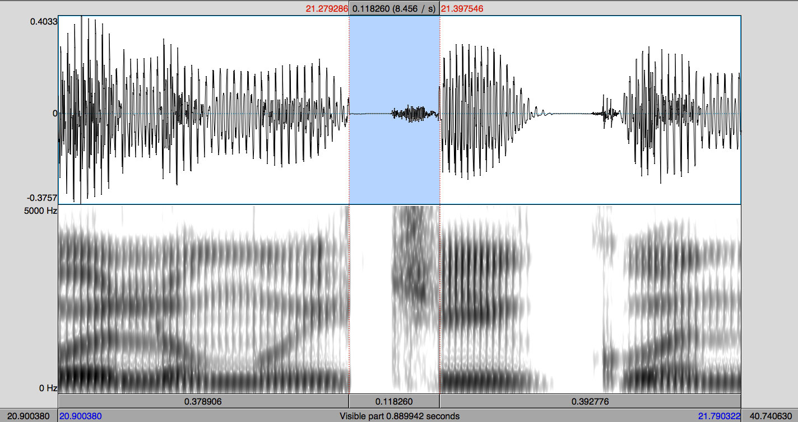
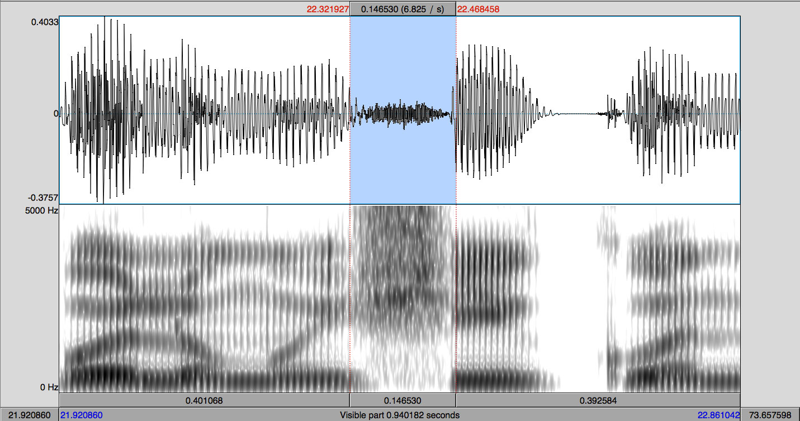

```{r}
#| label: setup
#| include: false
options(htmltools.dir.version = FALSE)
knitr::opts_chunk$set(
  echo = FALSE, 
  warning = FALSE, 
  message = FALSE, 
  fig.asp = .5625,
  out.width = "100%",
  fig.retina = 2,
  dpi = 300
  )

```

```{r}
#| label: xaringan-extra-all-the-things
#| echo: false
xaringanExtra::use_xaringan_extra(
  c("tile_view", "panelset", "editable", "search")
)
```

```{r}
#| label: helpers
#| echo: false
#| message: false
#| warning: false
source(here::here("assets", "scripts", "helpers.R"))
```

class: inverse, middle

# Housekeeping

---
background-image: url(https://st1.bgr.in/wp-content/uploads/2022/09/Google-Docs.jpg)
background-position: 95% 50%
background-size: 350px

<!-- google docs img -->

# Notes

.Large[

- Google doc

- Open to everybody

- Use if helpful

- [bit.ly/ldius_gd](https://docs.google.com/document/d/1BoBBtxSgAeqtQpEMbDx0TMjFkVlBL9Qe_nJ_dTnBFog/edit?usp=sharing)
]

---


class: inverse, middle

# Strangor (2009)

---
background-image: url(https://www.jvcasillas.com/media/teaching/img/think.png)
background-position: 95% 50%
background-size: 400px

# About the reading

.Large[
.pull-left[
- According to Strangor (2009) what limitations have probably prevented the field of Social Psychology from advancing/effecting as much social change as one might like? 
In what ways can one do more?

- Define prejudice.

- Define stereotype. Are all stereotypes bad? Explain.
]
]

???

Prejudice: a negative attitude toward a group or toward members of the group.

Stereotype: 
  1. knowledge structures that serve as mental 'pictures' of the groups in question
  2. the traits that come to mind quickly when we think about the groups

---
class: middle, center

# "We desire, as much as possible, to differentiate individuals from different categories from each other, and to view individuals within categories as maximally similar."

<br>

--

.pull-left[
.left[
- Reflect on this quote. 
In your experience is this true?
If so, can you think of other aspects of the human experience in which this is also true?
]
]

---
class: inverse

# Speech perception

### Big questions

.Large[

- How do we distinguish between speech and noise?

- How do we extract relevant information from a weak signal?

]

--
class: inverse

### Lack of invariance problem

.Large[
- Speech sounds are never pronounced exactly the same

- If I say **taco** [ˈta.ko] 10x, it is never exactly the same (acoustically)

- How are we able to relate sound with a concept of a phoneme?

]

---
class: inverse

# Categorical perception

.Large[
- "Equal sized physical differences are not equal sized psychologically."

- We don't perceive continua as continua...

- Within category differences are minimized

- Between category differences are maximized, exagerated
]

---
class: inverse
count: false
background-image: url(./assets/img/colors.png)
background-size: contain 

---
class: inverse
count: false
background-image: url(./assets/img/pc1.png)
background-size: contain 

---
class: inverse
count: false
background-image: url(./assets/img/pc2.png)
background-size: contain 

---
class: inverse

# Categorical perception

### How do we study categorical perception?

.Large[
- 2AFC (identification)

- AX (discrimination)
]

---
class: inverse
count: false
background-image: url(./assets/img/bapa1.png)
background-size: contain

---
class: inverse
count: false
background-image: url(./assets/img/bapa2.png)
background-size: contain

---
class: inverse
count: false
background-image: url(./assets/img/bapa3.png)
background-size: contain

---
class: inverse
count: false
background-image: url(./assets/img/bapa4.png)
background-size: contain

---
class: inverse
count: false
background-image: url(./assets/img/bapa5.png)
background-size: contain

---
class: inverse
count: false
background-image: url(./assets/img/bapa6.png)
background-size: contain

---
class: inverse
count: false
background-image: url(./assets/img/bapa7.png)
background-size: contain

---
class: inverse
count: false
background-image: url(./assets/img/pc3.png)
background-size: contain

---
class: inverse
count: false

# Categorical perception

.Large[
- "Equal sized physical differences are not equal sized psychologically."

- We don't perceive continua as continua...

- Within category differences are minimized

- Between category differences are maximized, exagerated
]

---

# Measurement

### What ways does the chapter describe for measuring prejudice/stereotypes? <br>Give examples in each of these areas: 

.Large[
- Self-report

- Nonreactive, indirect, or unobtrusive measures

- Physiological and neurological measures
]

.pull-left[
.content-box-blue[
.Large[
Which one is the best?  
Why?
]
]
]

.pull-right[
.content-box-green[
.Large[
Unfamiliar with a specific method? Look up examples.
]
]
]

???

- Self-report
  - thought listings 
  - trait check-offs 
  - probability judgments 
  - Likert scales
- Nonreactive, indirect, or unobtrusive behavioral measures
  - seating distance (Macrae et al., 1994) 
  - "implicit" reaction time measures
- Physiological and neurological measures
  - mapping out brain regions

!!not always clear that newer measures tell us more about the core social constructs of stereotyping and prejudice than older measures!!

tend to measure using whatever technology is most current

---

# IAT

.pull-left[
- With a partner, go to  
https://implicit.harvard.edu/implicit/selectatest.html  
and take an IAT test

- Choose whichever seems most (or least) interesting to you

- Focus on how it is designed, how it works, not on your responses (don't worry about what it tells you at the end)

- Take turns completing sections of the test

- Report to your group the test you did and your thoughts

- What are the positives and negatives of IAT tests?
]

--

.pull-right[
- According to the research presented in Strangor (2009), what is the outlook for reducing stereotyping and prejudice?

- Did the information surprise you?
]

---
class: inverse, middle

# Becker (2018)

## **The sociolinguistic interview**

---
class: inverse, middle, center

<iframe width="560" height="315" src="https://www.youtube.com/embed/of4XzrbkknM" title="YouTube video player" frameborder="0" allow="accelerometer; autoplay; clipboard-write; encrypted-media; gyroscope; picture-in-picture; web-share" allowfullscreen></iframe>

.left[
.footnote[https://www.youtube.com/watch?v=of4XzrbkknM]
]

---

# The sociolinguistic interview

.Large[
- What is TSI?

- why was the sociolinguistic interview developed? Why is it important?

- What kinds of questions can TSI answer?

- What do sociolinguists mean when they refer to vernacular? 
What is it and why is it important? 
What problems does it pose?

- What is the 'observer's paradox' and what problems does it pose for TSI?
]

???

"methodology developed within the Labovian variationist paradigm with the goal of systematically eliciting variation across contextual styles for use as the primary evidence for sociolinguistic stratification and linguistic change"

TSI constructed to provide evidence of socially stratified sociolinguistic variation of a speech community and of linguistic change in progress
(the community pattern is ultimately of interest, not the speech patterns of the individual)

---
class: inverse, middle

# Campbell-Kibler (2018)

---

# Campbell-Kibler (2018)

### Speaker Evaluation Studies

.pull-left[
.Large[
- What are verbal guises? How are they used?

- What is the matched guise technique?
]
]

--

.pull-right[
.content-box-red[
Recordings are played to listeners, who then share opinions about the voices they heard. 
The recordings differ in specific ways (one in Spanish and one in English, or in two different regional accents). 
Listener reactions (theoretically) indicate something about how the listeners view the language forms in question.
]
.Large[
- What potential problems can arise using this technique?
]
]

---
background-image: url(./assets/img/matched_guise.png)
background-size: contain

---
class: middle, center

# <grey>Arizona</grey>

.big[**Nogales**]

# <grey>Sonora</grey>


---
background-image: url("./assets/img/us.png")
background-size: contain
background-color: #A2CCFF

---
background-image: url("./assets/img/nogales0.png")
background-size: contain

---
background-image: url("./assets/img/nogales1.png")
background-size: contain
class: inverse

???

- 20 mil habitantes

- 95% de los cuales son hispanos

---
background-image: url("./assets/img/nogales4.png")
background-size: contain
class: inverse

???

- Prácticamente todo el mundo es bilingüe (se estima un 60%)

- Pero hay monolingües en español (20%), monolingües en inglés

---
background-image: url("./assets/img/nogales2.png")
background-size: contain
class: inverse

???

- Hay contacto constante

---
background-image: url("./assets/img/mexican_Cession.png")
background-size: contain
class: inverse


---

# The affricate phoneme

### /ʧ/ 
 
.Large[

- In "standard" Spanish this phoneme has one allophone: /ʧ/ → [ʧ] 

- There is dialectal variation
]

<p></p>
.Large[
- Ex. 
  - "corchetes" --> [koɾ.ˈʧe.tes]
  - "corshetes" --> [koɾ.ˈʃe.tes]
]
<p></p>

---

# El fonema africado 

### [ʧ] vs. [ʃ] 

<div align="center">
  
  
</div>

</br>

.pull-left[
<audio controls>
  <source src="./assets/img/audioch.ogg" type="audio/ogg">
  <source src="./assets/img/audioch.wav" type="audio/mpeg">
Your browser does not support the audio element.
</audio>
]

.pull-right[
<audio controls>
  <source src="./assets/img/audiosh.ogg" type="audio/ogg">
  <source src="./assets/img/audiosh.wav" type="audio/mpeg">
Your browser does not support the audio element.
</audio>
]

---
class: inverse, middle

# Clopper (2018)

## **Experiments**

---

# Experiments

### Speech production

.Large[
- Mention some of the speech production methods described 
]

???

word lists
sentence/story completion
responses to questions
picture naming
map tasks (in pairs)

---

# Let's try

### In groups

1. Download Praat and open it
2. Make a recording saying...
	- toot
	- teet
3. Measure formant frequencies (F1, F2) of the vowel for each word
4. Do it for each person in your group and write down the numbers
5. Once you've finished, bring me the numbers

---
count: false
background-color: black
exclude: false

```{r}
#| label: plot-vowels

ldius_vowels <- tibble::tribble(
  ~'id', ~'vowel', ~'f1', ~'f2', 
  "Joseph", "i",     318, 2416, 
  "Joseph", "u",     308, 1136, 
  "evc",    "i",     323, 2566, 
  "evc",    "u",     487, 2183, 
  "sn",     "i",     303, 2591, 
  "sn",     "u",     302, 1630, 
  "nc",     "i",     311, 2382, 
  "nc",     "u",     299, 1634, 
  "jmt",    "i",     301, 2452, 
  "jmt",    "u",     436, 1810, 
  "sanjana", "i",     305, 3116, 
  "sanjana", "u",     401, 1338, 
  "varshini", "i",     300, 2816, 
  "varshini", "u",     277, 1455, 
  "vicki", "i",     295, 2223, 
  "vicki", "u",     417, 1702, 
  "mohraty", "i",     296, 2420, 
  "mohraty", "u",     387, 1908, 
  "nirali", "i",     349, 962, 
  "nirali", "u",     393, 1720, 
  "anshurta", "i",     369, 2567, 
  "anshurta", "u",     316, 1478, 
  "anna", "i",     333, 915, 
  "anna", "u",     480, 1494, 
  "caroline", "i",     483, 2468, 
  "caroline", "u",     438, 1267, 
  "riya", "i",     316, 2783, 
  "riya", "u",     435, 1712, 
  "samantha", "i",     312, 2672, 
  "samantha", "u",     430, 1538, 
  "yahaira", "i",     355, 2632, 
  "yahaira", "u",     430, 1545
) %>% 
  mutate(is_bradlow = "Class")

bradlow <- tibble(
  id = "bradlow", 
  vowel = rep(c("i", "u", "a"), each = 10), 
  f1 = c(rnorm(10, 268, 20), rnorm(10, 326, 26), rnorm(10, 780, 83)), 
  f2 = c(rnorm(10, 2393, 239), rnorm(10, 1238, 160), rnorm(10, 1244, 145)), 
  is_bradlow = "1995 avg."
) %>% 
  arrange(id)

all_data <- bind_rows(ldius_vowels, bradlow)

vowel_means <- all_data %>% 
  group_by(vowel, is_bradlow) %>% 
  summarize(f1 = mean(f1), f2 = mean(f2), .groups = "drop")

all_data %>% 
  ggplot() + 
  aes(x = f2, y = f1) + 
  stat_ellipse(aes(group = interaction(vowel, is_bradlow), color = is_bradlow),
      type = "norm", show.legend = FALSE, geom = "polygon", 
      alpha = 0.25
    ) + 
    geom_point(aes(color = is_bradlow), alpha = 0.2, size = 2) + 
    geom_text(data = vowel_means, 
      aes(label = vowel, color = is_bradlow), 
      size = 9, show.legend = F) +
    scale_y_reverse() + 
    scale_x_reverse(position = "top") + 
    labs(y = "F1", x = "F2") + 
    scale_color_viridis_d(name = NULL, option = "C", begin = 0.4) + 
    scale_fill_viridis_d(name = NULL, option = "C", begin = 0.4) + 
    ggdark::dark_theme_bw(base_family = "Palatino", base_size = 14) + 
    theme(legend.position = "bottom")

```

---

# Experiments

### Speech perception

.Large[
- Mention some of the speech production methods described 
]

---
count: false
background-color: black
exclude: false

```{r}
#| label: get-data

data <- dir_ls(
  path = here("../../spanphon/categorical_perception/data"), 
  regexp = "\\.csv$"
  ) %>%
  map_dfr(read_csv, id = "source") %>% 
  transmute(
    id = participant, 
    response = key_resp_2afc.keys,
    stim = sound_file
  ) %>%
  mutate(
    stim = str_remove_all(stim, "./stim/iu/iu_"), 
    stim = str_remove_all(stim, ".wav"), 
    stim = as.numeric(stim)
  ) %>% 
  filter(!is.na(response))
```

```{r}
#| label: 2afc-plot 

data %>% 
  ggplot(., aes(x = stim, y = response)) + 
    geom_hline(yintercept = 0.5, lty = 3) + 
    geom_smooth(method = "glm", method.args = list(family = "binomial"), 
      formula = "y ~ x", color = "#cc0033") + 
    scale_x_continuous(
      breaks = 1:11, 
      labels = c("1\nteet", "2", "3", "4", "5", "6", "7", 
                 "8", "9", "10", "11\ntoot")
    ) + 
    labs(y = "p(teet)", x = "Continuum step") + 
    dark_theme_bw(base_family = "Palatino")
  
```

---


class: inverse, middle

# Quotable

---
class: middle, center

# "No matter how accurate our belief is, it does not describe every member of the group—therefore, basing judgments of individuals on category level knowledge is just plain wrong."

### .right[Strangor (2009)]

---
class: middle, center

# "[...] we are prejudiced because we feel that others that we care about are, too—that it is okay to be so. Similarly, we are tolerant when we feel that being so is socially acceptable."

### .right[Strangor (2009)]

---
class: inverse, middle

# About the reading

---

# What we saw this week

.Large[

- Methods used to evaluate prejudice and stereotypes in Social Psychology and Sociolinguistics

- The Sociolinguistic Interview

- Speaker evaluation studies via language attitude surveys

- Speech production and speech perception experiments

]

---
background-image: url(../assets/img/survey_qr.png)
background-position: 85% 50%
background-size: 350px

# About the reading...

.pull-left[
.Large[

- Use your superhero id (should be *exactly* the same)

- If you didn't do the reading you can say so  
(but do the reading next time!)

]
]

.pull-right[
</br></br></br></br></br>
</br></br></br></br></br>
</br></br></br></br></br>
.center[
.Large[[bit.ly/ldius_survey](https://run.pavlovia.org/jvcasillas/ldius_survey)]
]
]

---

class: inverse, middle

# Next week

---

# Next week

.Large[
- Take a break

- Personal reflection 2 assigned next week
]

---
layout: false
class: title-slide-final, left

# References

```{r}
#| label: bib
#| echo: false
#| results: 'asis'
#| message: false
bib <- ReadBib(here("assets", "bib", "ldius.bib"), check = FALSE)
ui <- "- "
```

```{r}
#| label: print-bib
#| results: 'asis'
#| echo: false
#| cache: false
#| warning: false
#| message: false
writeLines(ui)
print(bib[key = "becker_2018"], 
  .opts = list(check.entries = FALSE, 
               style = "html", 
               bib.style = "authoryear"))

writeLines(ui)
print(bib[key = "clopper_2018"], 
  .opts = list(check.entries = FALSE, 
               style = "html", 
               bib.style = "authoryear"))

writeLines(ui)
print(bib[key = "kibler_2018"], 
  .opts = list(check.entries = FALSE, 
               style = "html", 
               bib.style = "authoryear"))

writeLines(ui)
print(bib[key = "strangor_2009"], 
  .opts = list(check.entries = FALSE, 
               style = "html", 
               bib.style = "authoryear"))
```
